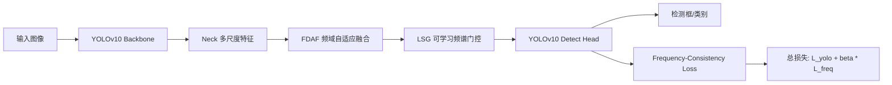
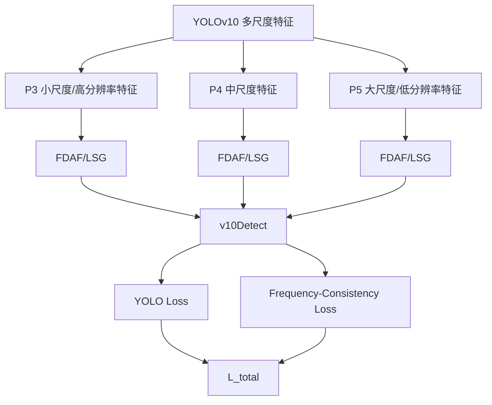
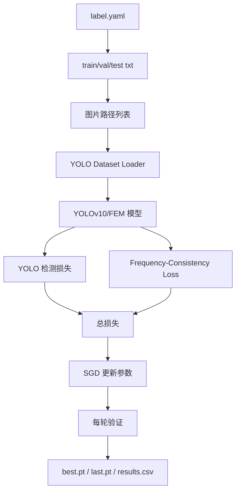

# VPD-100K 论文与复现实验笔记

## 0. 摘要

论文目标是做通用、细粒度的视觉隐私检测。它不是只检测人脸或车牌，而是把隐私目标扩展到人脸年龄/场景、证件、票据、账号、地址、机构名称、街道名称等 33 类对象。论文报告中，YOLOv10-S + FEM 的 AP 为 52.1，YOLOv10-L + FEM 的 AP 为 58.6。

已有复现实验结果低于论文报告指标。YOLOv10-S full/FEM 在已有实验中没有形成相对 baseline 的稳定增益。该现象与论文中 full/FEM 显著高于 baseline 的趋势不同，差异涉及数据划分、训练设置、FEM 实现细节、频率损失行为、预训练权重映射和验证口径等变量。

## 1. 论文分析

### 1.1 提出问题

视觉隐私保护需要在真实图片中定位并识别隐私区域。已有方法通常只关注少数显性隐私对象，例如人脸、车牌、证件，难以覆盖复杂场景中的细粒度隐私信息。

论文关注的问题是：

- 隐私类别多：不仅有人脸/车牌，还有证件、票据、账号、地址、姓名、机构名称等。
- 目标尺度变化大：隐私对象常常很小，例如文字、号码、票据局部字段。
- 场景泛化难：隐私对象分布在室内、街景、证件照、票据、视频帧等多种场景。
- 类别长尾明显：部分类别样本很多，部分类别样本很少，导致检测器容易偏向高频类别。

### 1.2 分析问题

已有方法主要包括三类：

| 方法类型 | 优点 | 难点 |
|---|---|---|
| 通用目标检测器 | 训练和部署成熟，例如 YOLO 系列 | 对小目标、细粒度隐私类别不够敏感 |
| 专用隐私检测器 | 对人脸、车牌等单类任务效果好 | 类别覆盖窄，难以泛化到复杂隐私对象 |
| 文档/文本隐私识别 | 对证件、票据、文字字段有帮助 | 对自然图像、多尺度目标和复杂背景不稳定 |

问题的关键变量包括：

- 类别粒度：33 类隐私目标比传统人脸/车牌检测更细。
- 目标尺度：AP_small 是重要指标，小目标检测能力直接影响隐私保护完整性。
- 高频/低频信息：隐私目标常依赖边缘、纹理、字符、局部频率模式。
- 长尾分布：低样本类别的召回率容易很低。
- 数据划分：训练集、验证集、测试集划分会显著影响 AP/F1。

### 1.3 解决问题

论文提出 VPD-100K 数据集和 FEM 模块。整体思路是在 YOLOv10 检测框架上增强频域信息建模，从而提升细粒度隐私目标，尤其是小目标和纹理/字符类目标的检测能力。

当前代码中的复现实验将模型拆成四个阶段：

| 阶段 | 含义 | 实验目的 |
|---|---|---|
| baseline | 标准 YOLOv10-S/L | 作为无 FEM 的基线 |
| fdaf | 加入频域分支和跨域融合 | 测试 FDAF 是否有效 |
| fdaf_lsg | FDAF + 可学习频谱门控 | 测试 LSG 是否进一步提升 |
| full | FDAF + LSG + Frequency-Consistency Loss | 对齐论文完整 FEM |

模型结构可以概括为：



论文实验结果中，FEM 相比 baseline 有明显提升：

| 模型 | AP | AP50 | AP75 | AP_small | AP_medium | AP_large | F1 |
|---|---:|---:|---:|---:|---:|---:|---:|
| YOLOv10-S | 46.3 | 62.7 | 51.3 | 26.1 | 53.2 | 62.7 | 0.65 |
| YOLOv10-S + FEM | 52.1 | 67.1 | 54.6 | 30.1 | 55.6 | 64.3 | 0.71 |
| YOLOv10-L | 53.8 | 69.6 | 58.4 | 33.6 | 59.8 | 70.8 | 0.73 |
| YOLOv10-L + FEM | 58.6 | 73.4 | 61.3 | 36.5 | 62.3 | 70.6 | 0.81 |

消融结果中，YOLOv10-S 从 baseline 到 full 逐步提升：

| 阶段 | AP | AP50 | AP75 | AP_small |
|---|---:|---:|---:|---:|
| baseline | 46.3 | 62.7 | 51.3 | 26.1 |
| FDAF | 48.5 | 64.2 | 52.8 | 27.5 |
| FDAF + LSG | 50.9 | 65.8 | 53.9 | 29.2 |
| full | 52.1 | 67.1 | 54.6 | 30.1 |

## 2. 代码架构分析

### 2.1 框架

当前项目基于本地修改版 Ultralytics YOLOv10：

| 文件/目录 | 作用 |
|---|---|
| `train_frequency.py` | 主要训练入口，支持 `baseline/fdaf/fdaf_lsg/full` 和 `s/l` 两种模型尺寸 |
| `evaluate_repro.py` | 验证 checkpoint，并和论文目标 AP/AP50/AP75 对比 |
| `run_paper_ablation.sh` | 顺序运行 YOLOv10-S 四个消融实验 |
| `audit_dataset.py` | 检查 YOLO 标签格式、类别范围、重复框等 |
| `ultralytics/nn/modules/block.py` | 包含 FDAF 模块实现 |
| `ultralytics/utils/loss.py` | YOLO loss 与 Frequency-Consistency Loss 集成 |
| `generated_configs/` | 训练时自动生成不同阶段的 YOLOv10 配置 |
| `datasets/ICML_2026_dataset/` | 数据集目录，包含图片、标签和 split 文件 |
| `runs/` | 训练输出、权重、日志、图表、验证结果 |

### 2.2 模型理论与设计分析

#### 2.2.1 基础检测框架：YOLOv10

当前复现实验以 YOLOv10 作为基础检测器。YOLOv10 的整体结构可以拆成三部分：

| 模块 | 作用 | 对隐私检测的影响 |
|---|---|---|
| Backbone | 提取图像的多尺度语义特征 | 决定模型对人脸、证件、车牌、文本等目标的基础表达能力 |
| Neck | 融合不同尺度特征 | 对小目标、中目标、大目标的共同检测能力有直接影响 |
| Detect Head | 输出类别和边界框 | 决定最终检测框、类别置信度和定位质量 |

YOLOv10 的检测头包含 one-to-many 和 one-to-one 两个训练分支。当前代码中，标准 YOLO 损失由 box loss、classification loss 和 DFL loss 组成：

```text
L_yolo = L_box + L_cls + L_dfl
```

其中 box loss 约束边界框位置，classification loss 约束类别预测，DFL loss 约束边界框分布式回归。FEM 的改动不是替换 YOLOv10 检测头，而是在特征融合阶段和损失函数阶段加入频域建模。

#### 2.2.2 频域建模的理论动机

隐私目标具有大量局部纹理和细节模式，例如证件号码、票据文字、车牌字符、地址字段、姓名字段和小尺寸人脸。这类目标的判别信息不完全依赖大范围语义，还依赖边缘、纹理、字符轮廓等局部高频成分。

空间域卷积直接处理像素或特征图的局部邻域；频域变换将特征拆解为不同频率成分。二者对应的信息侧重点不同：

| 表达域 | 主要信息 | 与隐私目标的关系 |
|---|---|---|
| 空间域 | 位置、形状、局部邻域、目标上下文 | 适合检测物体边界和语义结构 |
| 频域 | 边缘、纹理、周期性、细节强度 | 适合补充文字、号码、证件纹理、小目标边缘等细粒度线索 |

FEM 的理论核心是：在 YOLOv10 已有空间特征之外，引入频率响应，使模型能够在多尺度特征融合阶段保留和选择与隐私对象相关的频域细节。

#### 2.2.3 FEM 总体结构

FEM 在当前代码中由三部分构成：

| 子模块 | 名称 | 作用 |
|---|---|---|
| FDAF | Frequency-Domain Attention Fusion | 将空间特征转换到频域，得到频域调制后的空间特征，再与原空间特征融合 |
| LSG | Learnable Spectral Gating | 对频谱幅值生成可学习门控，选择性增强或抑制不同频率成分 |
| Frequency-Consistency Loss | 频率一致性损失 | 约束预测框区域和目标框区域在频域特征上的一致性 |

FEM 并不改变输入输出格式。输入仍为图像，输出仍为检测框、类别和置信度。它改变的是中间特征表达和训练约束。



#### 2.2.4 FDAF：频域自适应融合

当前代码中的 FDAF 位于 `ultralytics/nn/modules/block.py`。其前向过程如下：

```text
F_x = FFT2(x)
F_mod = F_x                         # 无 LSG 时
F_mod = F_x * sigmoid(gate(|F_x|))   # 有 LSG 时
y_spa = IFFT2(F_mod).real
out = Conv1x1(concat(x, y_spa)) + x
```

该结构包含三个关键设计：

| 设计 | 计算形式 | 含义 |
|---|---|---|
| 频域转换 | `FFT2(x)` | 将空间特征映射到频域 |
| 频域回投影 | `IFFT2(F_mod).real` | 将调制后的频域信息转换回空间特征 |
| 残差融合 | `Conv([x, y_spa]) + x` | 保留原始空间特征，同时注入频域增强特征 |

FDAF 的输入输出通道保持一致，因此可以作为 Neck 中的插入式模块。当前复现实验在 YOLOv10 的 P3、P4、P5 三个检测尺度前插入 FDAF，对三个尺度的检测特征同时进行频域增强。

#### 2.2.5 LSG：可学习频谱门控

LSG 对频域幅值 `|F_x|` 计算门控权重：

```text
w_gate = sigmoid(Conv1x1(|F_x|))
F_mod = F_x * w_gate
```

其作用不是固定增强高频或低频，而是通过训练学习每个通道、每个空间频率响应的重要性。门控值经过 sigmoid 限制在 0 到 1 之间，因此它表现为一种频谱选择机制。

在四个消融阶段中，LSG 的启用关系如下：

| stage | FDAF | LSG |
|---|---:|---:|
| `fdaf` | 是 | 否 |
| `fdaf_lsg` | 是 | 是 |
| `full` | 是 | 是 |

这种设计将“频域特征引入”和“频谱可学习选择”拆开，便于单独观察 FDAF 和 LSG 对结果的影响。

#### 2.2.6 Frequency-Consistency Loss：频率一致性约束

Frequency-Consistency Loss 位于 `ultralytics/utils/loss.py`。它在正样本位置上比较预测框区域和目标框区域的频域特征差异。当前实现过程如下：

1. 根据 TaskAlignedAssigner 得到正样本 `fg_mask`。
2. 取正样本的预测框 `pred_bboxes` 和目标框 `target_bboxes`。
3. 将框坐标映射到 P3 特征图坐标。
4. 对预测框区域和目标框区域执行 ROIAlign。
5. 对 ROI 特征执行 FFT2。
6. 计算频域幅值差异，并使用半径权重增强较高频率成分。

损失形式可以写为：

```text
L_freq = mean( (w(r) * |FFT(ROI_pred) - FFT(ROI_target)|)^2 )
w(r) = 1 + lambda * r
L_total = L_yolo + beta * L_freq
```

其中 `r` 是频率半径，`lambda` 控制频率半径权重，`beta` 控制 frequency loss 在总损失中的权重。论文明确给出 `beta=0.05`，当前代码默认值也为 `0.05`。

当前实现中的 frequency loss 只在 `full` 阶段启用，并默认作用于 YOLOv10 的 one-to-many 分支：

| stage | Frequency Loss |
|---|---:|
| `baseline` | 否 |
| `fdaf` | 否 |
| `fdaf_lsg` | 否 |
| `full` | 是 |

#### 2.2.7 多尺度插入位置

当前 `train_frequency.py` 生成的模型配置中，baseline 和 FEM 模型的 head 结构不同。baseline 直接将 P3/P4/P5 三个尺度输入 `v10Detect`；FEM 模型在三个尺度进入检测头前分别插入 FDAF。

| 检测尺度 | 特征含义 | FEM 插入点 |
|---|---|---|
| P3 | 高分辨率特征，小目标敏感 | C2f 后插入 FDAF |
| P4 | 中等分辨率特征，中尺度目标敏感 | Neck 融合后插入 FDAF |
| P5 | 低分辨率高语义特征，大目标敏感 | C2fCIB 后插入 FDAF |

该结构对应论文中对小目标和细粒度隐私信息的关注：P3 保留较多空间细节，P4/P5 保留更强语义信息，三个尺度同时增强可以覆盖不同尺寸隐私对象。

#### 2.2.8 模型设计与实验指标的对应关系

论文指标中 AP_small、AP_medium、AP_large 分别反映不同尺度目标的检测效果。FEM 的设计与这些指标之间存在如下对应关系：

| 设计 | 主要影响对象 | 对应指标 |
|---|---|---|
| P3/P4/P5 多尺度 FDAF | 小、中、大目标 | AP_small、AP_medium、AP_large |
| LSG 频谱门控 | 纹理和字符类目标 | AP、AP50、AP75 |
| Frequency-Consistency Loss | 定位框区域的频域一致性 | AP75、mAP50-95 |
| 残差融合 | 保留 YOLOv10 原空间表达 | 稳定 baseline 能力 |

论文表格中 YOLOv10-S + FEM 相对 YOLOv10-S 的提升主要体现在 AP、AP50、AP75 和 AP_small。该结果与 FEM 的设计目标一致：频域增强提高细粒度特征表达，频率一致性损失提高目标区域特征约束。

### 2.3 逻辑结构

训练数据流：



输入：

- 图片：`dataset/images/*.jpg`
- 标签：`dataset/labels/*.txt`
- 数据划分：`split/*.txt`
- 配置文件：`split/label.yaml` 或重新生成的 `label_rtx4090d_val2k.yaml`
- 预训练权重：`weights/yolov10s.pt` 或 `weights/yolov10l.pt`

输出：

- 权重：`runs/.../weights/best.pt`、`last.pt`
- 训练曲线：`results.csv`、`results.png`
- 标签分布图：`labels.jpg`
- 验证图表：confusion matrix、PR 曲线等
- 指标对比：`paper_comparison.json`

### 2.4 网络结构

当前代码支持两种模型尺寸：

| 参数 | 含义 |
|---|---|
| `--model-size s` | YOLOv10-S，对应论文中 YOLOv10-S / YOLOv10-S + FEM |
| `--model-size l` | YOLOv10-L，对应论文中 YOLOv10-L / YOLOv10-L + FEM |

四种 stage 的差异：

| stage | FDAF | LSG | Frequency Loss |
|---|---:|---:|---:|
| `baseline` | 否 | 否 | 否 |
| `fdaf` | 是 | 否 | 否 |
| `fdaf_lsg` | 是 | 是 | 否 |
| `full` | 是 | 是 | 是 |

当前 loss 逻辑重点：

- 论文给出的 `beta=0.05` 已对齐。
- 当前实现为 `L_total = L_yolo + beta * L_freq`。
- Frequency loss 只在 `full` 阶段启用。
- 当前默认对 YOLOv10 的 one-to-many 分支计算频率一致性损失。
- 为避免 ROIAlign 过大导致 OOM，代码新增 `--freq-max-rois`，默认 256。严格复现时可设为 0，但 YOLOv10-L/FEM 容易 OOM。

### 2.5 训练参数

论文明确写出的参数：

| 参数 | 论文 | 当前代码 |
|---|---:|---:|
| 框架 | PyTorch | PyTorch/Ultralytics |
| 设备 | NVIDIA A100 GPU cluster | 当前尝试过 4090D、H800/A800、AMD MI308X |
| 优化器 | SGD | SGD |
| momentum | 0.937 | 0.937 |
| weight decay | 5e-4 | 5e-4 |
| beta | 0.05 | 0.05 |

论文未明确公开、当前按项目/Ultralytics 默认设置的参数：

| 参数 | 当前设置 |
|---|---:|
| epochs | 默认 100，可设 300 |
| batch | 默认 16 |
| imgsz | 640 |
| lr0 | 0.01 |
| lrf | 0.01 |
| warmup_epochs | 3.0 |
| close_mosaic | 10 |
| mosaic | 1.0 |
| mixup | 0.0 |
| amp | 默认关闭 |
| seed | 0 |
| deterministic | True |

实验记录中的关键控制变量：

- 数据 split 文件。
- 模型尺寸：S 或 L。
- stage：baseline/fdaf/fdaf_lsg/full。
- epoch、batch、imgsz。
- 是否启用 `freq-max-rois`。
- 训练设备和 PyTorch/CUDA/ROCm 版本。

## 3. 复现实验结果展示

### 3.1 已有实验结果

| 实验 | 设备/验证集 | P | R | mAP50 | mAP50-95 | 备注 |
|---|---|---:|---:|---:|---:|---|
| YOLOv10-S baseline 100e | RTX 4090D，完整 val | 0.416 | 0.550 | 0.438 | 0.320 | baseline |
| YOLOv10-S full 100e | RTX 4090D，完整 val | 0.420 | 0.541 | 0.433 | 0.312 | full 未超过 baseline |
| YOLOv10-S full 继续训练 checkpoint | RTX 4090D，完整 val | 0.424 | 0.544 | 0.442 | 0.322 | 略高于 baseline，但远低于论文 |
| YOLOv10-S full 300 checkpoint | AMD，随机 val2000 | 0.388 | 0.515 | 0.412 | 0.293 | 验证集规模为 2000 |

### 3.2 与论文目标差距

以 YOLOv10-S + FEM 为目标，论文指标为：

| 指标 | 论文 YOLOv10-S + FEM | 当前较好完整 val 结果 | 差距 |
|---|---:|---:|---:|
| mAP50-95 / AP | 0.521 | 0.322 | -0.199 |
| mAP50 | 0.671 | 0.442 | -0.229 |
| F1 | 0.71 | 未完整稳定记录 | 待补 |

以随机 val2000 的 AMD 结果对比论文 full：

| 指标 | 论文 full | 当前 val2000 | 差距 |
|---|---:|---:|---:|
| AP | 0.521 | 0.293 | -0.228 |
| AP50 | 0.671 | 0.412 | -0.260 |
| AP75 | 0.546 | 0.306 | -0.240 |

### 3.3 差异分析

已有实验没有复现论文趋势。论文中 full 明显优于 baseline，而当前 full 与 baseline 接近，100 epoch 时 full 指标还略低于 baseline。该差异不能只由 epoch 数量解释，因为 full 与 baseline 的相对关系本身没有对齐。

可能相关变量如下：

| 变量 | 对结果的影响 |
|---|---|
| 数据划分 | 原论文未公开完整 split 文件；不同 train/val/test 划分会改变 AP、F1 和类别分布 |
| 验证集规模 | val2000 与完整验证集不是同一评估口径，不能直接等价比较 |
| 训练轮数 | 100 epoch 与 300 epoch 会影响收敛，但不能单独解释 full 未超过 baseline |
| 设备与框架 | CUDA 与 ROCm 的算子、显存管理、稳定性存在差异 |
| FDAF 插入位置 | 插入位置变化会改变特征流和预训练权重匹配关系 |
| 预训练权重映射 | FDAF 插入后层号偏移，权重 remap 是否正确影响初始化质量 |
| Frequency loss | `beta * L_freq` 的分支、权重和 ROI 采样方式会影响 full 阶段 |
| `freq-max-rois` | 该参数为工程性显存控制项，论文未报告；启用后会改变 frequency loss 的 ROI 采样 |

### 3.4 实验命令记录

RTX 4090D 上使用随机 val2000 划分的 YOLOv10-S full 训练命令：

```bash
python train_frequency.py \
  --model-size s \
  --stage full \
  --data datasets/ICML_2026_dataset/split/label_rtx4090d_val2k.yaml \
  --weights weights/yolov10s.pt \
  --epochs 100 \
  --batch 16 \
  --imgsz 640 \
  --device 0 \
  --workers 8 \
  --project runs/rtx4090d_val2k \
  --name yolov10s_full_b16 \
  --freq-max-rois 128
```

论文报告与当前实验设置之间的客观差异：

| 项目 | 论文报告 | 当前实验记录 |
|---|---|---|
| 设备 | NVIDIA A100 GPU cluster | RTX 4090D、A800/H800、AMD MI308X 均有尝试 |
| 数据 split | 未在论文截图中完整公开 | 本地/服务器生成过完整 split 与 val2000 split |
| epoch | 未明确公开 | 100 和继续训练 checkpoint |
| batch | 未明确公开 | 单卡常用 16，多卡尝试过总 batch 64 |
| frequency loss beta | 0.05 | 0.05 |
| optimizer | SGD | SGD |
| momentum | 0.937 | 0.937 |
| weight decay | 5e-4 | 5e-4 |
| ROI 上限 | 未报告 | 当前代码包含 `freq-max-rois` |
